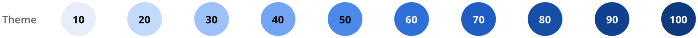

想给博客弄一个夜间模式，怎么弄的？直觉就是把颜色都反过来，然后怎么反？所以就想弄一个主题。

## Primary（主色）
App 的整体主色调。 场景：表单的提交按钮，导航

## Secondary（副色），Accent
我的理解就是用来辅助主色的，因为只有一种颜色（主色）的话，会容易产生视觉疲劳。

场景：各种场景的 toast；引人注目的，比如通知，删除按钮等

## grey（灰色）
也叫中性色（ Neutral ），用到他的地方比你想象得要多。 场景：文字，背景，边框等。

## How

对于主色和副色，我们先选择一个基色（ Base Color ）。他有10个梯度（shade or ramps）。
6-10作为 light theme（字体颜色为白色）的背景色，梯度6作为 light theme 的基色；
1-5梯度作为 night theme（字体颜色为黒色）的背景色，梯度5作为 dard theme 的基色。

梯度1和梯度10可以分别作为 light theme 和 mode theme 的背景色。

首先选择梯度6，然后选梯度1和梯度10，最后选剩余的梯度。
虽然基色是有很多种选择，但是我们不妨选择饱和度高点和亮度高点的颜色。
记住，背景色和字体颜色的对比度要符合 WCAG 2.0 标准，即大于 4.5:1 。

灰色的话，我们不需要选择中性色，直接先选梯度1和梯度10就好。

嗯，最后看了 [designing-systematic-colors](https://uxplanet.org/designing-systematic-colors-b5d2605b15c) 之后，我就放弃了。

但还是学到怎么建立一个调色板。

## 现有的 design system

* https://polaris.shopify.com/design/colors
* https://mineral-ui.com/color

## 扩展阅读
* https://refactoringui.com/previews/building-your-color-palette/
* https://palx.jxnblk.com/
* [Ant Design 色板生成算法演进之路](https://zhuanlan.zhihu.com/p/32422584)
* https://uxplanet.org/designing-systematic-colors-b5d2605b15c